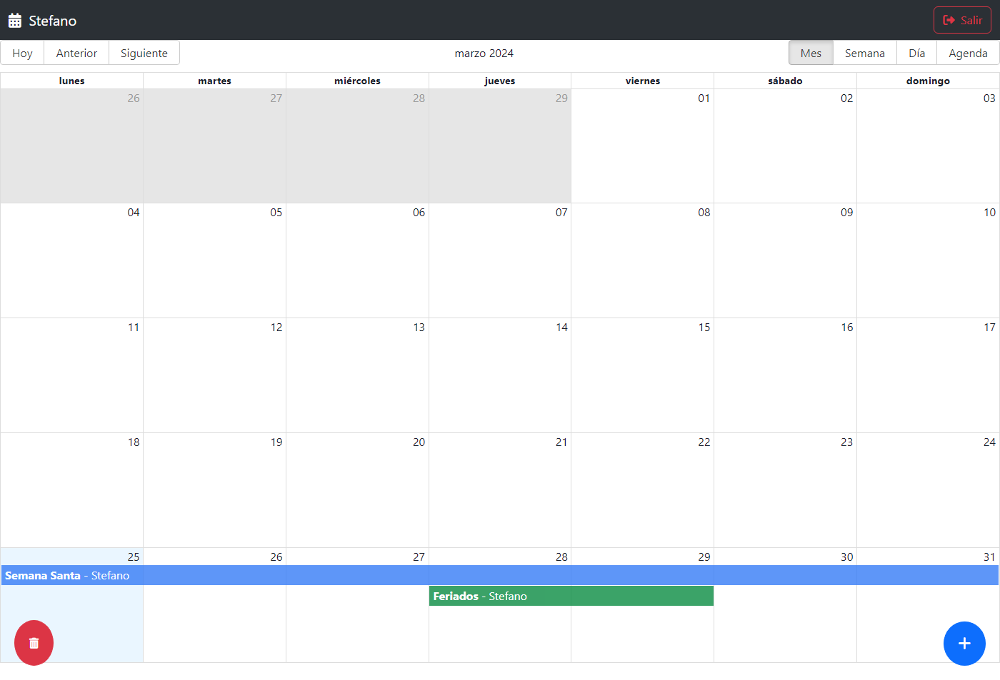

# Calendar App



Aplicación web para crear eventos de calendario. La aplicación cuenta con un sistema de autenticación de usuario y protección de rutas. Además, de un sistema de creación, actualización y eliminación de eventos.

### Instalación

Clona el repositorio y navega hasta el directorio:

```bash
git clone https://github.com/StefanoP21/calendar-app.git
```

### Instala las dependencias:

```bash
npm install
#or
yarn add
```

### Variables de Entorno

Cree un archivo .env en la carpeta raíz de su proyecto y añada sus variables. Consulte .env.template para obtener ayuda.

### Ejecución en modo de desarrollo

Para iniciar la aplicación en modo de desarrollo, ejecuta:

```bash
npm run dev
#or
yarn dev
```

### Ejecución de las pruebas

Para iniciar las pruebas de la aplicación, ejecuta:

```bash
npm run test
#or
yarn test
```

### Ejecución en modo de producción

Para construir la aplicación para producción, ejecuta:

```bash
npm run build
#or
yarn build
```

### Tecnologías

- [JavaScript](https://developer.mozilla.org/es/docs/Web/JavaScript)
- [React](https://es.react.dev/)
- [React Router](https://reactrouter.com/)
- [Redux Toolkit](https://redux-toolkit.js.org/)
- [Chakra UI](https://chakra-ui.com/)
- [SweetAlert2](https://sweetalert2.github.io/)

### Autor

- [Stefano Palomino](https://github.com/StefanoP21)

### Licencia

Este proyecto está disponible para su uso bajo la Licencia MIT.
